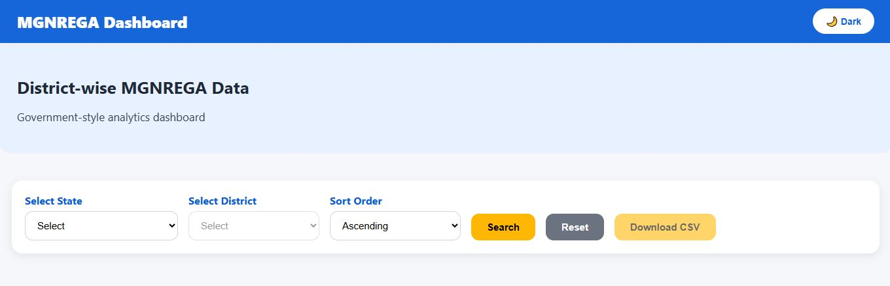
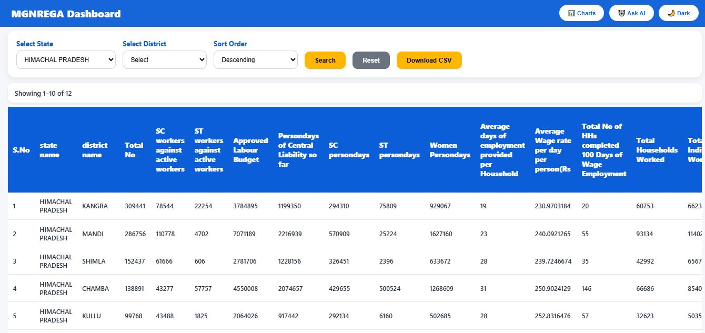
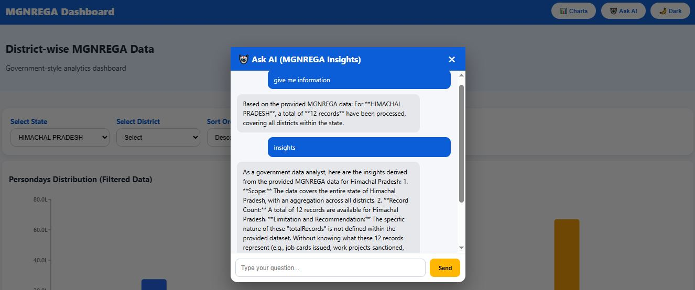
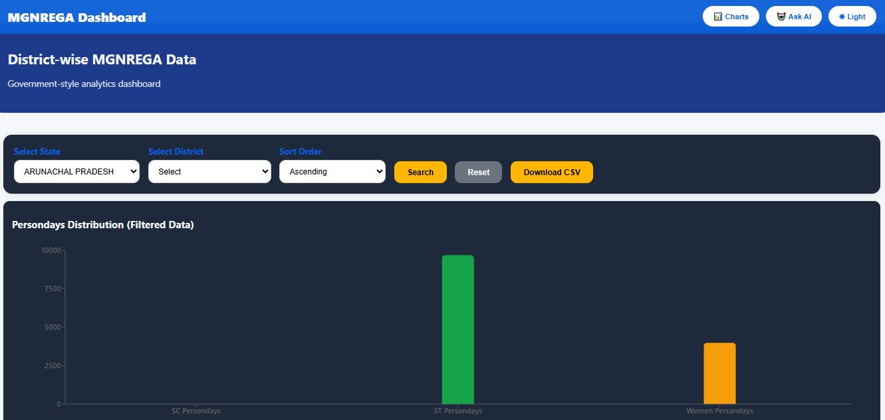

# MGNREGA Analytics Dashboard with AI-Powered Insights  
*(Mahatma Gandhi National Rural Employment Guarantee Act)*

##  Overview
The **MGNREGA Analytics Dashboard** is a full-stack, data-driven web application designed to analyze and visualize district-wise employment data under the **Mahatma Gandhi National Rural Employment Guarantee Act (MGNREGA)**.  

The platform enables users to filter large government datasets, visualize key employment metrics through interactive charts, and generate **AI-powered analytical insights** 

This project demonstrates real-world use of the **MERN stack**, database aggregation, REST APIs, and AI integration for decision-making support.

---

##  Key Features

###  Advanced Data Filtering
- Filter MGNREGA data by **State** and **District**
- Server-side filtering using MongoDB queries
- Pagination for handling large datasets efficiently

###  Interactive Data Visualization
- Bar charts and pie charts for data comparisons.
- Percentage-based insights in pie charts
- Charts rendered dynamically based on filtered data

###  AI-Powered Insights 
- Integrated **Google Gemini API** for intelligent analysis
- ChatGPT-like modal interface for asking questions
- AI analyzes:
  - Aggregated persondays
  - Employment trends
  - Gender and caste participation patterns
- Context-aware responses based on selected filters

###  Data Export
- Download filtered MGNREGA data as **CSV**
- Useful for offline analysis and reporting

###  UI & UX Enhancements
- Light/Dark mode toggle
- Responsive design for mobile, tablet, and desktop
- Clean government-style dashboard layout
- Modal-based AI chat interface

---

##  Tech Stack

### Frontend
- **React.js**
- **JavaScript (ES6+)**
- **CSS3 (Theme + Responsive Design)**
- **Fetch API**

### Backend
- **Node.js**
- **Express.js**
- **RESTful APIs**

### Database
- **MongoDB**
- **MongoDB Atlas**
- Aggregation & filtering queries

### AI Integration
- **Google Gemini (Generative Language API)**
- Prompt-based data analysis

### Tools & Deployment
- Git & GitHub
- MongoDB Compass
- Render (Backend Deployment)
- Vercel (Frontend Deployment)
- Vite (Frontend Build Tool)

---

## Local Deployment (Run Project on Your System)

Follow the steps below to run the MGNREGA Analytics Dashboard locally.

---

## Prerequisites
Make sure you have the following installed:
- Node.js (v18+ recommended)
- MongoDB (Local MongoDB OR MongoDB Compass)
- Git
- npm

---

## Clone the Repository

- Backend Setup (Node.js + Express + MongoDB)

Navigate to backend folder
cd backend

Install backend dependencies
npm install

Import CSV Data into MongoDB (Local)
Open MongoDB Compass

Connect to:
mongodb://127.0.0.1:27017

Create Database:
nrega

Create Collection:
records

Click Import Data → CSV

Select your MGNREGA CSV file

Import as Documents

---Your data is now available for the backend---

Start Backend Server:
nodemon server.js

If successful, you will see:
MongoDB connected
Server running on port 5000

Navigate to frontend folder:
cd frontend

Install frontend dependencies
npm install

Start Frontend Server:
npm run dev

## Project Screenshots

### Dashboard Overview

### State & District Filtering

### Charts & Analytics

### AI-Powered Insights (Gemini)

### Dark Mode

Author:

Sahil Kumar
Full Stack Developer 